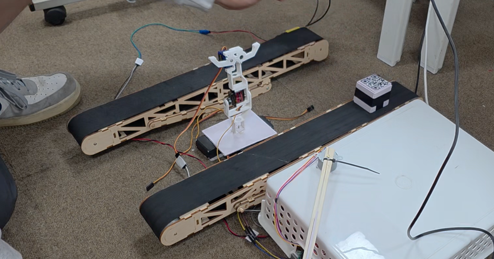
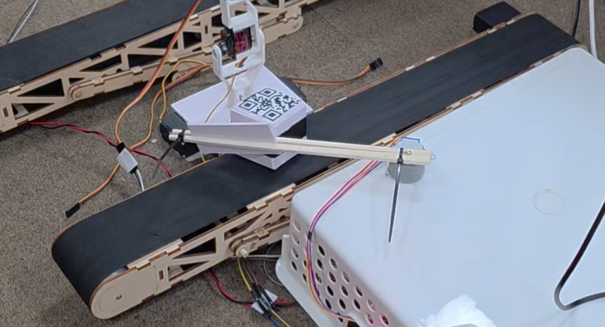
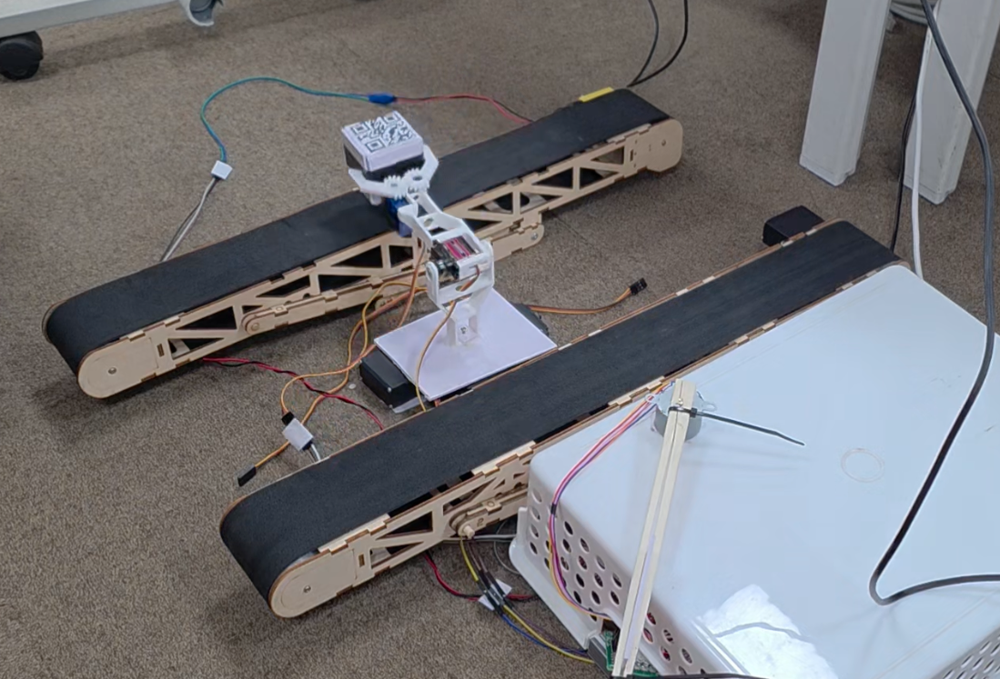
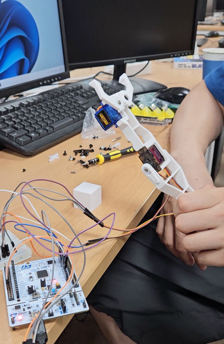
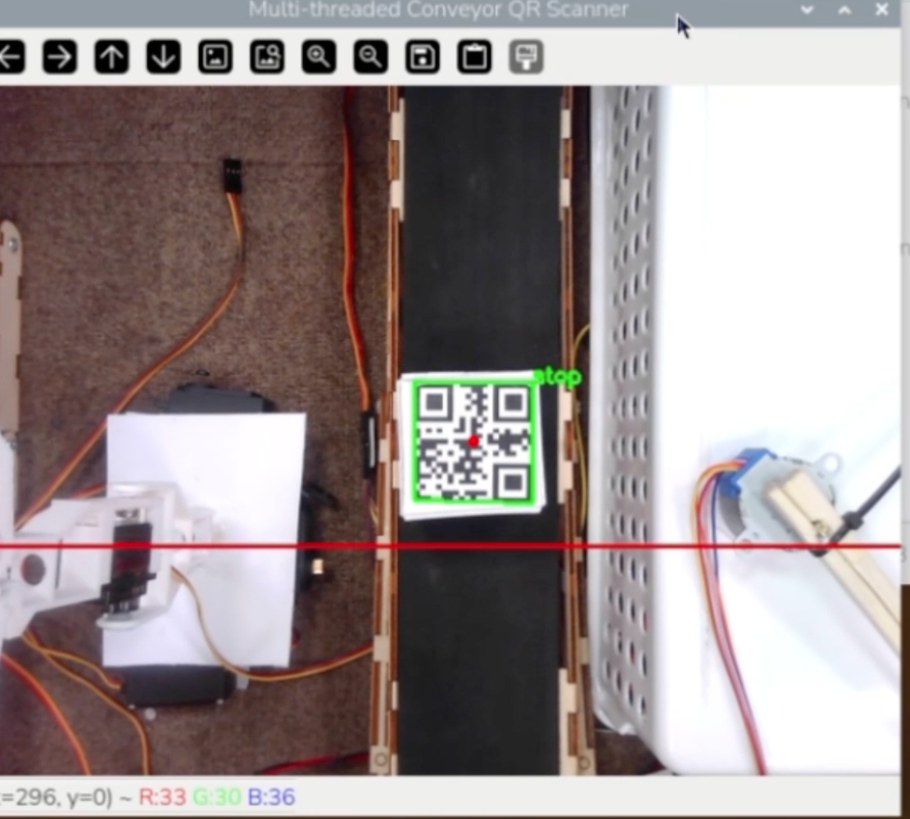
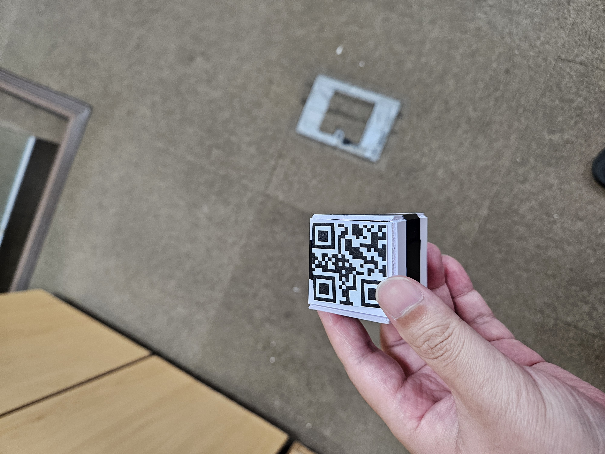

# ConveyorBelt_Project
컨베이어벨트 위로 움직이는 물체를 분류하여 로봇팔로 처리하는 팀프로젝트

## 프로젝트 한눈에 보기
이 프로젝트는 카메라로 물체를 인식하고, 불량품과 정상품을 구분한 뒤 로봇팔과 컨베이어 벨트를 이용해 자동으로 처리하는 시스템입니다. 실제 구현 화면과 구성도를 함께 보며 프로젝트의 전체 흐름을 이해할 수 있습니다.

<div align="center">
  
  <p><b>전체 시스템 구성</b></p>
</div>

### 핵심 동작
- 카메라를 통해 물체를 인식하고 분류합니다.
- 분류된 물체를 로봇팔이 집어 반대편 벨트로 옮깁니다.
- CAN 통신으로 로봇팔과 벨트 제어를 연동합니다.

### 프로젝트 사진 갤러리
| 사진 | 설명 |
|------|------|
|  | 시스템 동작 흐름을 한눈에 보여주는 흐름도 |
|  | 분류기가 물체를 분류하는 실제 동작 모습 |
|  | 로봇팔이 물체를 반대편 벨트로 옮기는 모습 |
|  | 로봇팔의 구조와 부품 구성 |

### 추가 사진
- 
- 
- 

## 개발환경

- 개발 환경 (Development Environment)

    - IDE: STM32CubeIDE

    - Configuration Tool: STM32CubeMX

    - Language: C / C++

    - OS (Raspberry Pi): Ubuntu / Raspberry Pi OS


## **STM32CubeMX학습**
- 자동 줄맞춤 단축어, ctrl + shift + f

### MCU
- CPU에 디지털 신호, PWM, 통신과 같이 임베디드 시스템에서 많이 사용되는 주변장치를 연결하여 하나의 칩으로 제작된 형태
- Cortex - A, R, M으로 나뉘는데 A쪽이 높은 성능
    - A, 스마트폰, 태블릿, PC, 고성능 임베디드 프로세서
    - R, 실시간 프로세싱 고성능 임베디드 프로세서, 의료기기, 항공우주, 자동차 등
    - M, 초저전력, 실시간 처리, 범용적 사용
- stm32 f446re는 M4의 기능

### 클럭 (Clock)
- 시스템 클럭을 PLL로 180MHz까지 끌어올려 사용
    - PLLM=8, PLLN=180, PLLP=2 → (HSI 16MHz ÷ 8 × 180 ÷ 2) = 180MHz
- 버스마다 동작 가능한 클럭 속도가 다르므로 분주(divider)가 걸림
    - AHB: 180MHz
    - APB1: 180 ÷ 4 = **45MHz** (F446RE의 APB1 최대 한계가 45MHz라 자동으로 DIV4)
    - APB2: 180 ÷ 2 = 90MHz
- 타이머는 APB 클럭에 ×2가 적용됨 → **TIM2 클럭 = 90MHz** (PWM 계산의 기준)
- CAN1은 APB1 버스에 연결됨 → **CAN 비트레이트 계산의 기준이 45MHz**

### 인터럽트
- Polling 방식
    - 무언가 행동을 할 때 다른 행동은 대기

- Interrupt 방식
    - interrupt handler를 통해 행동을 진행하고 있다가 다른 행동도 가능
- NVIC(Nested Vectored Interrupt Controller)
    - M시리즈를 사용하는 경우 ARM에서 개발한 NVIC라는 인터럽트 컨트롤러를 공통적으로 사용

- 처리방법
    - 인터럽트 호출할 함수인 ISR(Interrupt Service Routine)를 정의
    - 우선순위 저장
    - 우선순위에 따라 ISR 수행

### 타이머&카운터
- ARR(Auto ReLoad Register) : 최대 카운트 값
- CCR(Compare Capture Register) : 카운트 값을 설정
- 오버플로우가 될때마다 발생하는 원리
- Counter Mode UP/Down : 0->ARR로 올라가는 기본적인 방법으로 UP을 사용
- auto-reload preload : ARR(Counter period) 값을 바꿀 때 언제 반영되느냐, Enable -> 현재 주기가 끝나는 순간에 깔끔하게 반영

### PWM 서보 제어
- RC 서보(MG90S, SG90)는 **50Hz(20ms 주기) PWM의 펄스폭으로 각도를 제어**
- 타이머 설정값 (TIM2 클럭 90MHz 기준)

    | 항목 | 값 | 의미 |
    |------|-----|------|
    | Prescaler | 90 - 1 | 90MHz → 1MHz (1 tick = 1µs) |
    | Counter Period(ARR) | 20000 - 1 | 1MHz → 50Hz (20ms 주기) |
    | Pulse(CCR) | 500 ~ 2500 | 펄스폭(µs) = 각도 |

- 펄스폭 ↔ 각도 환산
    - 500 (0.5ms) → 0도
    - 1500 (1.5ms) → 90도
    - 2500 (2.5ms) → 180도
- 핵심 코드 (채널의 펄스폭을 바꿔 각도 제어)
    ```c
    __HAL_TIM_SET_COMPARE(&htim2, TIM_CHANNEL_1, 1500); // 채널1을 90도로
    ```
- 주의: SG90/MG90S는 끝단(0도/180도)에서 떨릴 수 있어 600~2400 범위로 좁혀 쓰기도 함
- 서보 전원은 **외부 5V** 사용 (보드 5V핀은 부하를 못 버팀), STM32와 **GND 공통 연결 필수**


## FreeRTOS 학습
- "신호 받으면 움직인다"를 구현하는 핵심 구조 = **생산자-소비자 패턴**
    - CAN 수신 인터럽트(생산자)가 세마포어를 give → 모터 태스크(소비자)가 take 하여 동작
    - 폴링으로 계속 확인하는 대신, 신호가 올 때까지 **블로킹 대기**하므로 CPU 효율적
- Task: 하나의 태스크 = 하나의 함수 (Entry Function이 실제 실행 본체)
    - 이번 프로젝트의 모터 제어 본체는 `motorTask01`
- 주의할 설정
    - **SYS Timebase Source를 SysTick → TIM6로 변경**해야 함
        - FreeRTOS가 SysTick을 스케줄러용으로 점유하기 때문에 HAL 시간 기준은 별도 타이머로 분리
        - 변경하지 않으면 시스템이 꼬일 수 있음
    - 모든 사용자 코드는 `USER CODE BEGIN ~ END` 사이에만 작성
        - 영역 밖 코드는 CubeMX가 코드 재생성 시 삭제함
- 핵심 코드 (태스크: 신호 올 때까지 대기 후 동작)
    ```c
    if (osSemaphoreAcquire(canSemaphoreHandle, osWaitForever) == osOK) {
        // 동작 수행
    }
    ```

### 세마포어 VS 큐
- 세마포어는 전달 내용이 없는 신호만 전달 => 메모리 소모가 적고 처리 속도가 빠름
- 메시지 큐는 실제 데이터를 전달
    - 이번 프로젝트의 경우는 그냥 불량감지만 하면 로봇팔은 넘기는 동작만 하면 되기에 세마포어가 적절
    - 만약, 불량감지를 무거움, 가벼움 등 구분지어야 한다면 메시지큐를 사용해야함
```c
canSemaphoreHandle = osSemaphoreNew(1, 0, &canSemaphore_attributes);
// 에서 두번째값이 초기값인데 1이면 세마포어가 이미 차있기때문에 신호를 안줘도 한 번 실행이됨. >> 0으로 바꿔주면 됨
```

## CAN 통신
- 노드 구성
    - 로봇팔제어 (0x123)
    - 라즈베리 카메라 센서 (0x124)
    - 컨베이어벨트 제어 (0x125)

### 비트레이트 (Baud Rate)
- **버스에 연결된 모든 노드의 비트레이트가 동일해야** 통신 가능 (이번 프로젝트는 500kbps)
- 계산식: `Baud = APB1 ÷ Prescaler ÷ (1 + BS1 + BS2)`
    - 45MHz ÷ 9 ÷ (1 + 7 + 2) = **500kbps**
    - 샘플포인트 = (1 + BS1) ÷ 전체TQ = 8 ÷ 10 = **80%** (CAN 표준 권장값)

    | 항목 | 값 |
    |------|-----|
    | Prescaler | 9 |
    | Time Quanta in Bit Segment 1 | 7 |
    | Time Quanta in Bit Segment 2 | 2 |
    | SJW | 1 |

### 수신 (Rx) - 필터로 거른다
- CAN은 모든 메시지가 버스에 흘러다니므로, 원하는 ID만 받도록 **필터(Filter)** 설정
- 표준 ID(11비트)는 레지스터 상위 비트에 정렬되므로 `<< 5` 필요 (헷갈리기 쉬운 부분)
    ```c
    sFilterConfig.FilterIdHigh = (0x124 << 5);   // 0x124만 통과
    ```
- 수신 콜백에서 세마포어를 give 하여 모터 태스크를 깨움 (핵심 패턴)
    ```c
    void HAL_CAN_RxFifo0MsgPendingCallback(CAN_HandleTypeDef *hcan) {
        HAL_CAN_GetRxMessage(hcan, CAN_RX_FIFO0, &RxHeader, RxData);
        if (RxHeader.StdId == 0x124) {
            osSemaphoreRelease(canSemaphoreHandle); // 태스크 깨움
        }
    }
    ```

### 송신 (Tx) - ID 딱지를 붙여 보낸다
- 송신은 필터가 필요 없고, 보낼 메시지에 대상 ID를 적어서 버스에 뿌리면 됨
- 같은 ID로 보내더라도 **데이터 값으로 명령을 구분**할 수 있음
    - 0x125에 `0x01` → 1번 벨트 재작동
    - 0x125에 `0x02` → 2번 벨트 작동
    ```c
    CAN_Send(0x125, 0x01);  // 0x125로 데이터 0x01 송신
    ```


## 동작 시나리오 요약
- 대기 상태: 모터(로봇 팔)는 90도를 유지하며 대기.

- 트리거 (Rx): 라즈베리파이(0x124)에서 CAN 통신으로 '불량품 감지' 메시지 수신 → 세마포어로 모터 태스크 깨움.

- 픽업: 모터가 0도로 이동하여 물건을 집음 (Gripper 작동).

- 1번 벨트 재작동 (Tx): 물건을 집은 직후 0x125에 `0x01` 송신 → 멈춰있던 첫 번째 벨트 다시 가동.

- 이동: 모터가 180도로 이동하여 반대쪽 컨베이어 벨트 위에 물건을 놓음.

- 2번 벨트 가동 (Tx): 0x125에 `0x02` 송신 → 두 번째 벨트 가동.

- 복귀: 모터가 다시 90도로 돌아와 다음 명령 대기.


## 트러블슈팅 / 배운 점
- `extern`: 다른 파일에 정의된 변수(`canSemaphoreHandle` 등)를 가져다 쓸 때 선언 필요
    - 헤더(`#include "can.h"`, `"tim.h"`)를 포함해야 `hcan1`, `htim2` 등 핸들 접근 가능
- main의 `while(1)`은 FreeRTOS 사용 시 도달하지 않으므로 비워둠 (모터 제어는 태스크가 담당)
- 서보 테스트 단계에서 정상/불량 판별 기준
    - 정상: 세 위치(0/90/180도)로 끊어가며 정확히 이동
    - 불량: 안 움직임 / 한 방향만 / 계속 떨림(지터) / 과열

