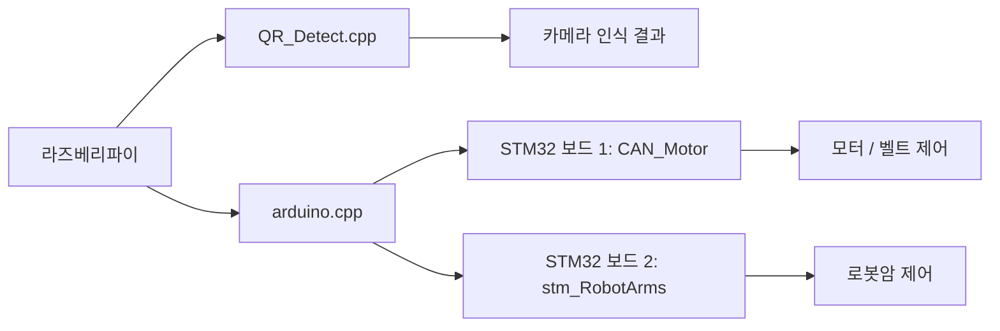

# ConveyorBelt_Project

컨베이어벨트 위에서 이동하는 물체를 실시간으로 인식하고, 그 결과에 따라 로봇팔과 벨트 제어를 자동으로 수행하는 임베디드 시스템 프로젝트입니다. 이 프로젝트는 카메라 기반 인식, 통신 프로토콜, 실시간 제어, 멀티보드 협업까지 하나의 시스템으로 연결한 경험을 담고 있습니다.

## 1. 프로젝트 개요

이 프로젝트는 다음과 같은 문제를 해결하기 위해 구성되었습니다.

- 컨베이어벨트 위 물체를 사람의 개입 없이 자동으로 판별해야 함
- 인식 결과를 빠르게 제어 명령으로 변환해야 함
- 로봇암과 모터/벨트 제어를 하나의 흐름으로 연동해야 함

실제 구현은 다음과 같이 나뉩니다.

- 라즈베리파이 측 소프트웨어: QR_Detect.cpp, arduino.cpp
  - 카메라로 QR/바코드를 인식하고 판별 결과를 생성
  - 인식 결과를 Arduino를 통해 제어 명령으로 전달
- STM32 보드 1: CAN_Motor 폴더 프로젝트
  - CAN 통신과 모터/벨트 제어 담당
- STM32 보드 2: stm_RobotArms 폴더 프로젝트
  - 로봇암 제어 담당

## 2. 하드웨어 구성

```text
라즈베리파이
├── QR_Detect.cpp      # 카메라 인식 및 판별
└── arduino.cpp        # 통신 중계/명령 전달

STM32 보드 1 (CAN_Motor)
└── 모터 / 벨트 제어

STM32 보드 2 (stm_RobotArms)
└── 로봇암 제어
```

## 3. 폴더 구조

```text
con/
├── README.md
├── Makefile
├── QR_Detect.cpp          # 라즈베리파이에서 실행되는 QR 인식 프로그램
├── arduino.cpp            # 라즈베리파이에서 사용하는 통신 중계 코드
├── BaseCode/              # STM32 실습용 예제 코드 모음
├── CAN_Motor/             # STM32 보드 1용 프로젝트 (모터/벨트 제어)
├── ConveyorBelt_Project/   # 프로젝트 관련 문서/자료
└── stm_RobotArms/         # STM32 보드 2용 프로젝트 (로봇암 제어)
```

### 주요 폴더 역할

- BaseCode: STM32CubeMX / FreeRTOS / CAN 통신 학습용 예제
- CAN_Motor: 첫 번째 STM32 보드에서 작업한 모터 제어 프로젝트
- stm_RobotArms: 두 번째 STM32 보드에서 작업한 로봇암 제어 프로젝트
- ConveyorBelt_Project: 프로젝트 설명 및 참고 자료

## 4. 시스템 아키텍처



## 5. 핵심 기술 및 작업 흐름

### 적용 기술

- 이미지 처리 및 인식: OpenCV, ZBar
- 통신 프로토콜: UART, CAN
- 임베디드 개발 환경: STM32CubeIDE, STM32CubeMX
- 실시간 제어: FreeRTOS
- 하드웨어 제어: 서보, 모터, 컨베이어 벨트

### 포트폴리오 포인트

- 단일 센서 입력을 기반으로 실제 액추에이터 제어까지 연결한 풀 스택형 임베디드 프로젝트
- 라즈베리파이와 STM32 간 분산 제어 구조를 설계하고 연동
- 멀티보드 협업 환경에서 통신 기반 제어 로직을 구현

### 작업 흐름도(이미지 느낌)

```text
[카메라 촬영]
      ↓
[QR 인식 / 판별]
      ↓
[인식 결과를 Arduino로 전송]
      ↓
[Arduino가 명령 분기 처리]
      ├─ 정상/통과 → 모터/벨트 유지
      ├─ 불량/정지 신호 → 로봇암 동작
      └─ 기타 분류 결과 → 해당 동작 수행
            ↓
      [STM32 보드 1: 모터/벨트 제어]
            ↓
      [STM32 보드 2: 로봇암 제어]
            ↓
      [작업 완료]
```

## 6. 동작 흐름

1. 라즈베리파이의 카메라가 컨베이어벨트 위의 물체를 촬영합니다.
2. QR_Detect.cpp가 인식 결과를 판별합니다.
3. arduino.cpp가 판별 결과를 기반으로 제어 신호를 생성하고 전송합니다.
4. STM32 보드 1은 모터/벨트 동작을 제어하고,
5. STM32 보드 2는 로봇암 동작을 제어합니다.
6. 두 STM32가 협업하여 물체를 분류합니다.

## 7. 주요 소스 파일 설명

- QR_Detect.cpp
  - OpenCV와 ZBar를 이용해 QR 인식
  - 인식 결과에 따라 제어 신호를 생성

- arduino.cpp
  - 라즈베리파이 측에서 사용하는 통신 코드
  - CAN/시리얼 명령을 STM32로 전달

- CAN_Motor 프로젝트
  - 모터와 벨트 제어를 담당하는 STM32 firmware

- stm_RobotArms/Core/Src/main.c
  - 로봇암 제어용 STM32 메인 루틴
  - CAN 수신, FreeRTOS 태스크, 서보/모터 제어 포함

## 8. 개발/실행 순서

1. 라즈베리파이에 OpenCV, ZBar 환경을 구성합니다.
2. CAN_Motor 프로젝트를 한 대의 STM32 보드에 업로드합니다.
3. stm_RobotArms 프로젝트를 다른 STM32 보드에 업로드합니다.
4. 라즈베리파이에서 아래 명령으로 인식 프로그램을 실행합니다.

```bash
make
./qr_scanner
```

> OpenCV, ZBar가 설치되어 있어야 실행 가능합니다.

## 9. 참고 포인트

- CAN 통신은 두 STM32 보드가 함께 동작하도록 연결됩니다.
- 하나의 STM32는 모터/벨트 제어, 다른 하나는 로봇암 제어를 담당합니다.
- 실제 동작은 카메라 인식 → 제어 신호 전달 → STM32 제어 순서로 진행됩니다.

## 10. 한 줄 요약

이 프로젝트는 컴퓨터 비전, 임베디드 제어, 통신 시스템을 통합해 실제 자동화 장비의 동작 흐름을 구현한 경험을 보여주는 포트폴리오 프로젝트입니다.
